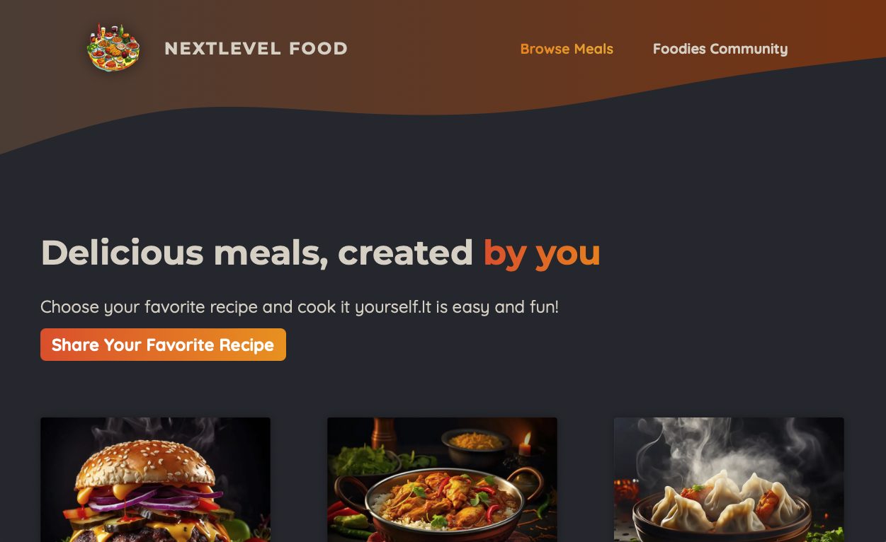

# Udemy - Nextlevel Food

This is a solution to the [NextJS Course](https://www.udemy.com/course/nextjs-react-the-complete-guide/).

## Table of contents

- [Overview](#overview)
  - [The challenge](#the-challenge)
  - [Screenshot](#screenshot)
  - [Links](#links)
- [My process](#my-process)
  - [Built with](#built-with)
  - [What I learned](#what-i-learned)
  - [Continued development](#continued-development)
  - [Useful resources](#useful-resources)

## Overview

### The challenge

Users should be able to:

- View the optimal layout for the site depending on their device's screen size
- See hover states for all interactive elements on the page
- Open a lightbox gallery by clicking on the large product image
- Switch the large product image by clicking on the small thumbnail images
- Add items to the cart
- View the cart and remove items from it

### Screenshot



### Links

- Solution URL: [Add solution URL here]()
- Live Site URL: [Add live site URL here]()

## My process

### Built with

- Semantic HTML5 markup
- CSS custom properties
- Flexbox
- CSS Module
- Mobile-first workflow
- [React](https://reactjs.org/) - JS library
- [Next.js](https://nextjs.org/) - React framework

#### Dependencies

- [better-sqlite3](https://www.npmjs.com/package/better-sqlite3) - To setup backend
- [Slugify](https://www.npmjs.com/package/slugify)
- [xss](https://www.npmjs.com/package/xss)
- [react-router](https://www.npmjs.com/package/react-router)

### What I learned

1. `NextJS` setup router in two way: `Page Router` and `App Router`. Here's App Router in `./app` for example.

```text
├── community
│   ├── page.js
│   └── page.module.css
├── globals.css
├── icon.png
├── layout.js
├── meals
│   ├── [mealSlug]
│   │   ├── page.js
│   │   └── page.module.css
│   ├── error.js
│   ├── loading-out.js
│   ├── loading.module.css
│   ├── page.js
│   ├── page.module.css
│   └── share
│       ├── page.js
│       └── page.module.css
├── not-found.js
├── page.js
└── page.module.css
```

- `page.js`: Create under the folder, it would automatically change to page.

- `layout.js`: Container of `page.js`, you can setup metadata or some global component(navbar for exaple). If child page don't have their own `layout.js`, it would apply to their parent's.

- `error.js`: If something goes wrong, it would show up error page.

- `[mealSlug]`:It's a dynamic page, you can get value by `params` in NextJS.You can replace `mealSlug` with name whatever you want. For example:

```js
// In localhost:3000/meals/burger

export defualt function MealsPage({params}){

  console.log(params.mealSlug) //it would print out burger

}

```

2. Both `Server Component` and `Client Component` is available in NextJS. To make best use of server component, you should write them specificly. Here, we save bakcend code in `/lib` for example, and some client component in `/components/image-picker.js`. While apply client component, it would make sure run the rest of code in server side.

```js
    <p>
      <label htmlFor="instructions">Instructions</label>
      <textarea
        id="instructions"
        name="instructions"
        rows="10"
        required
      ></textarea>
     </p>
    <ImagePicker label="Your Image" name="image" />
    {state.message && <p>{state.message}</p>}
    <p className={classes.actions}>
      <MealsFormSubmit />
  </p>
```

`<ImagePicker/>` and `<MealsFormSubmit/>` would build in client side.

### Continued development

### Useful resources
